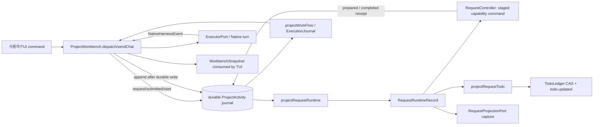

# Core domain/application/runtime 경계 감사

- 일시: 2026-09-13
- 범위: `src/core/{domain,application,runtime,ports}`의 Request/Workbench/Todo/Workflow 흐름 및 Code-ID 원장
- 방법: 읽기 전용 소스·테스트·원장 대조. 코드 수정 없음.

## 판정

`Request Runtime`은 제품의 고정 7단계 상태 규칙, effect broker, Todo/외부 전달 projection으로 이미 가장 명확한 Core capability이다. `ProjectWorkbench`는 그 capability를 소비하는 application facade여야 하나, 현재는 Native 실행 수명·journal replay·Request Runtime의 cache/persistence·Todo 동기화·T-note/review/Linear/MCP·TUI command/snapshot까지 한 객체에서 조립한다. `TodoLedger`도 수동 Todo 명령과 두 종류의 projection persistence를 함께 가진다.

따라서 첫 구현은 큰 Workbench 분해가 아니라 **Request Runtime projection coordinator를 `ProjectWorkbench`에서 추출**하는 것이 가장 안전하고 가치가 높다. reducer의 규칙은 이미 잘 테스트되어 있으며, 추출 대상은 cache/직렬화/effect scheduling이라 domain 의미를 바꾸지 않는다.

## 정본과 현재 책임의 대조

`CONTEXT.md`는 Request Runtime을 Application Runtime의 책임으로 정의하고(16행), Todo.md를 Request의 7 stage와 Native 하위 작업의 **읽기 전용 projection**으로 정의한다(10–11행). `LAYERS.md`는 Domain=제품 capability, Application=use case, Runtime=실행 상태와 receipt, 외부 기능=port/adapter를 요구한다(10–14, 36, 40–56행).

| 영역 | 실제 state / command / event 흐름 | 경계 판정 |
|---|---|---|
| Request Runtime domain | `REQUEST_STAGES`, `RequestRuntimeRecord`, `RequestStage`, evidence/decision/delivery type 및 strict report parser가 `domain/execution/request-runtime.ts`에 있다. | 제품의 고정 상태 언어와 report 유효성 규칙이므로 Domain에 적합하다. parser는 provider SDK가 아닌 공개 protocol envelope 검증이다. |
| Runtime reducer | `projectRequestRuntime(journal, threadId)`는 append-only `ProjectActivity`를 replay해 submitted→stage report/action/delivery/terminal 상태를 만든다. effect를 실행하지 않으며 foreign evidence, private reasoning, failed verification, stage 순서를 fail-closed 처리한다. | `core/runtime`의 "실행 상태와 receipt"에 정확히 맞는다. `projectRequestRuntime`은 command handler가 아니라 pure reconstruction이다. |
| Application command broker | `RequestController.handle()`은 runtime-tool call을 serialize하고, revision/turn/stage/capability를 확인한 뒤 write-ahead `runtime/action-prepared`를 journal에 남기고 capability effect를 한 번만 호출한다. restart 뒤에는 reconcile read-back만 허용한다. | Application에 적합하다. `RequestActionCapability` port를 통해서만 effect를 수행하고 replay가 effect를 재실행하지 않는다. |
| Request projections | `projectRequestTodo`는 7 parent + Native-authored task detail을 `TodoDocument`로, `projectRequestDestinations`는 Chat/Linear/Obsidian/GitHub text로 바꾼다. | 데이터 변환은 Domain projection으로 허용되지만 destination-specific prose는 앞으로 application projection/publisher로 옮길 후보다. 현재 external write는 하지 않는다. |
| Todo persistence | `TodoLedger.syncRequestRuntime()`은 request projection을 CAS store에 쓰고 session event를 남긴다. `syncNativePlan()`은 native plan projection도 같은 document에 쓴다. 그 밖에 `create/add/start/complete/block/reopen/evidence`는 수동 Todo 상태 전이를 소유한다. | CAS/event side effect 때문에 Application이다. 그러나 manual ledger와 Request/Native projection writer라는 세 책임이 한 class에 공존한다. |
| Workbench facade | constructor가 Executor subscription, RequestController registration, approval, todo subscription을 연결하고, `makeSnapshot()`가 Request/Workflow/Execution/Todo/Chat/T-note/Linear/MCP/TUI HUD 값을 한 snapshot에 투영한다. `scheduleRequestProjections()`는 Request projection persistence와 Todo sync를 직접 queue한다. | Application orchestration 자체는 타당하나 facade가 너무 넓다. 특히 projection sink scheduling은 Native conversation lifecycle과 독립된 seam이다. |
| Workflow projection | `projectWorkFlow()`는 durable activity journal에서 deterministic plan identity, revision reconciliation, orphan/rejection, action association을 산출한다. | 실질 상태 규칙은 Domain에 맞는다. 다만 raw Native activity payload의 method/markdown parsing까지 포함하므로 provider event normalizer를 application으로 올릴 장기 seam이 있다. 이것은 첫 추출 대상이 아니다. |

## 실제 흐름



중요한 방향은 `journal → reducer → projection`이다. Request Runtime의 truth는 `ProjectActivity`이며 Todo/파일 projection과 Workbench snapshot은 truth가 아니다. `ProjectWorkbench`는 이 방향을 지키지만, 현재 projection의 cache·선택·실패 메시지·queue를 자기 state에 포함해 lifecycle logic와 결합한다.

## 혼합 책임과 추출 seam

### ProjectWorkbench

`ProjectWorkbench`는 3,171행이며, `ProjectWorkbenchOptions`가 runtime tools, local workflow, development observer, todo, T-note, review, Woo entry, Linear dashboard, model persistence, HUD/slash configuration까지 받는다. state도 durable journal, execution run, work-flow, Request Runtime cache/queue, UI selection/chat/draft/action result를 함께 가진다.

근거:

- constructor는 `RequestController` 생성·runtime tool 등록·approval dispatcher·Native/Todo subscription을 동시에 수행한다 (`src/core/application/orchestration/project-workbench.ts:364-430`).
- initialization은 journal restore, execution receipt repair, Native resume/start, Todo binding, Linear refresh를 한 procedure에서 처리한다 (`:618-757`).
- snapshot은 `requestRecords()`/`projectRequestTodo()`와 work flow, execution, presentation fields를 함께 산출한다 (`:2185-2262`).
- `requestRecords()`와 `scheduleRequestProjections()`가 cache, destination capture, Todo sync queue, retry-visible error를 한 곳에서 소유한다 (`:2410-2443`).

이것은 import 방향 위반은 아니다. 그러나 `Request Runtime` 변화가 Native chat queue/T-note/MCP/Linear/HUD lifecycle의 가장 큰 class를 수정하게 만드는 ownership 혼합이다.

**즉시 추출 가능한 seam:** `RequestRuntimeProjectionCoordinator` (제안 파일: `src/core/application/orchestration/request-runtime-projection.ts`). 책임은 다음으로 한정한다.

1. immutable journal+thread ID에서 `projectRequestRuntime` cache를 계산한다.
2. 마지막/active request를 선택한다.
3. 변경된 request만 `RequestProjectionPort.capture()`로 직렬 전달한다.
4. 선택 request만 `syncRequestRuntime()` sink에 보내며, sync 상태/실패를 result로 돌려준다.

Workbench는 journal append 뒤 coordinator에게 input을 넘기고, 반환한 `{ records, selected, todoResult? | error? }`만 snapshot에 조립한다. coordinator는 Executor, TUI command, native subscription, `TodoLedger` concrete type, `ProjectWorkbench`를 import하지 않는다. Todo persistence는 adapter가 주입하는 narrow sink contract로 받는다.

### TodoLedger

`TodoLedger`의 manual state machine은 명확하고 검증되어 있다. 특히 active item/evidence-completion, CAS conflict, external watch, deterministic native plan identity 검사가 하나의 persistence application service에 결속돼 있다 (`src/core/application/work/todo-ledger.ts:20-294`, `:435-465`).

혼합은 기능 중복이 아니라 input authority가 세 갈래라는 점이다.

- manual command: `create/add/addDetails/start/complete/block/reopen/recordEvidence`
- legacy Native Plan projection: `syncNativePlan(flow, binding)`
- Request Runtime projection: `syncRequestRuntime(request)`

`CONTEXT.md`의 현재 의미상 protocol Request에서는 수동 명령을 허용하지 않아야 하며 Workbench도 이를 차단한다 (`project-workbench.ts:1474-1490`). 반면 `TodoLedger` 자체는 protocol/manual 구별을 모른다. 이는 persistence component가 policy를 가질 필요가 없다는 장점이지만, projection strategy가 Workbench에 분산된 이유이기도 하다.

**seam:** 위 coordinator가 `TodoLedger`의 `syncRequestRuntime`만 narrow `RequestTodoProjectionSink`로 사용한다. `TodoLedger` 분해나 `syncNativePlan` 이동은 후속이다. 먼저 manual Todo API를 건드리면 24개 ledger behavior test와 legacy session이 함께 흔들린다.

### Workflow projection

`projectWorkFlow`는 event journal만 받아 deterministic hash identity와 reconciliation을 계산한다. source digest/sequence 무결성, ambiguous revision retirement, orphan handling은 Domain rule로 유지해야 한다. `TodoLedger.syncNativePlan`도 native-checklist authority, revision monotonicity, 48-char prefix collision을 fail-closed로 검증한다.

단, `workflow-projection.ts`의 `isPlanRevision`, `rawPlanEntries`, markdown fallback parser가 raw Native payload의 `method`, `params.item.type`, textual plan format을 읽는다 (`src/core/domain/work/workflow-projection.ts:815-983`). 새 executor의 event format을 추가할 때 Domain 파일을 수정해야 하는 결합이다. 장기적으로 Adapter/Application이 `ProjectActivity`를 normalized `NativePlanRevision` event로 만들고 Domain은 그 value object만 받는 것이 더 깊은 경계다. 지금은 dplan-v1 identity와 existing receipt replay가 넓게 의존하므로 변경 비용이 높다.

### Legacy SessionRuntime와 ports

`SessionRuntime`은 legacy compatibility path로 분리돼 있으나 `core/application/session/session-runtime.ts:1-7`에서 `@earendil-works/pi-ai` SDK type을 직접 import하고 model loop를 호출한다. `core/ports/index.ts:1-36`도 `Context`, `Tool`, stream/auth types를 SDK type으로 노출한다. `LAYERS.md:36`의 "외부 SDK … Adapter가 소유"와는 맞지 않는다. 현재 architecture test는 repo 내부 relative import만 graph로 검사하므로 이 위반을 잡지 못한다 (`test/architecture/import-graph.ts:16-20`; `test/architecture.test.ts:24-37`).

이는 Native Workbench와 분리된 legacy path이므로 first bundle에 섞지 않는다. 다만 제거/유지할 때는 `ModelClient`와 `AgentTool`에 WWW-owned stream/tool DTO를 만들고 `pi-harness`가 변환하도록 별도 migration으로 다뤄야 한다.

## ID namespace 판정

### 권고

새 Unit은 **`Code-016`**으로 발급한다. `CORE-F###`, `CORE-F###-U##`는 도입하지 않는다.

- `CONTEXT.md`에서 Unit은 지속 기능/독립 책임의 정체성이고 Linear issue와 별개다 (48–52행). Request Runtime은 이 정의에 맞는 단일 Unit이다.
- 현재 runtime/traceability contracts는 `Code-\d{3}`만 수용한다. `local-unit-registry.ts:86-87`, `git-commit-control.ts:87`, `traceability-validator.ts:265-266`, `obsidian-contract.ts:87`, Linear contract 모두 `Code-NNN`을 전제한다. `CORE-F001`은 registry, Linear, Obsidian, commit control의 기존 정규식과 호환되지 않는다.
- `Code-016-U01`은 Unit hierarchy를 현재 identifier 문법에 섞는다. 독립 Unit이면 각각 새 `Code-NNN`, Unit 내부 member면 registry `locations[].members`와 코드 symbol로 표현하는 것이 현 schema와 맞다.

### 충돌/원장 상태

- 소스 선언에는 Code-001…015가 이미 존재한다. `Code-015`는 `gemini-cli-auth.ts`, Code-011은 `TodoLedger`, Code-002는 `ProjectWorkbench`가 소유한다.
- traceability-v2/registry에는 Code-001…014가 보인다.
- 반면 현재 `.www/control-ledger/code-ids.json`은 `0001`…`0005` 다섯 개만 등록한다. 따라서 이 파일 단독으로 다음 번호를 정하면 Code-006…015를 놓친다.
- `scripts/code-id.ts`는 **등록된** code locations만 검사하므로 이 drift를 전역 중복으로 잡지 못한다. 실제 Code-015를 먼저 예약한 뒤 새 Unit을 `Code-016`으로 기록해야 한다.

`Code-016`의 이름은 **Request Runtime control and projections**로 하고, 대표 location은 public orchestration entry인 `RequestController`로 한다. `code-ids.json`에는 numeric `id: "0016"`, 코드에는 `@Unit Code-016`와 대표 `@codeId 0016`을 기록하며, reducer/projection file은 같은 Unit의 locations로 추가한다. `ProjectWorkbench`의 Code-002는 chat conversation lifecycle ownership을 유지하며 Code-016에 병합하지 않는다.

## 가장 안전하고 가치 높은 첫 구현 묶음

### 범위

1. `src/core/application/orchestration/request-runtime-projection.ts`를 추가한다.
   - 공개 symbol: `RequestRuntimeProjectionCoordinator`.
   - 입력: `readonly ProjectActivity[]`, `threadId`, `activeTurnId`, `RequestProjectionPort`, narrow `syncRequestRuntime(record)` sink.
   - 출력: immutable records/selected request와 sync outcome. persistence failure는 journal truth를 바꾸지 않고 recoverable result로 돌린다.
2. `src/core/application/orchestration/project-workbench.ts`에서 `requestCache`, `requestProjectionQueue`, `requestProjectionKeys`, `requestRecords()`, `scheduleRequestProjections()`의 effect scheduling을 coordinator 호출로 교체한다. `WorkbenchSnapshot` shape와 `WorkbenchTodoSource`의 concrete API는 이 단계에서 보존한다.
3. `src/core/application/orchestration/request-controller.ts`, `src/core/runtime/request-runtime.ts`, `src/core/domain/execution/request-runtime.ts`의 protocol/reducer semantics는 변경하지 않는다.
4. Code-016 traceability를 registry/manifest/representative declaration에 함께 추가한다. 먼저 Code-006…015 registry drift를 reconcile한 뒤에 발급한다.

### 정확한 검증 대상

- 새 `test/request-runtime-projection.test.ts`
  - 같은 journal+thread에서 cache/replay 결과가 `projectRequestRuntime`과 byte-equivalent.
  - active request만 Todo sink로 전달한다.
  - identical record는 capture/sync를 중복 실행하지 않는다.
  - capture 또는 Todo sink 실패가 journal-derived record를 바꾸지 않고 다음 observation에서 retry한다.
  - foreign thread/request와 terminal request selection을 처리한다.
- 기존 `test/request-runtime.test.ts`: seven-stage/parallel task/VERIFY evidence/private reasoning behavior.
- 기존 `test/request-controller.test.ts`: write-ahead, authorization staleness, no replayed write, read-back reconciliation.
- 기존 `test/project-workbench.test.ts`의 Request Runtime/Todo mirror cases와 `test/project-workbench-session.test.ts`의 Todo sync failure/conflict cases.
- `bun test test/architecture.test.ts`, `bun run check`, Code-ID/traceability checks.

### 제외 이유

- `TodoLedger` manual state machine 분해: CAS/evidence/detail/legacy session behavior까지 동시 변경된다.
- `workflow-projection` raw Native event normalizer 추출: dplan-v1 identity, native Todo source authority, execution receipt replay를 동시에 옮겨야 한다.
- `SessionRuntime` SDK DTO migration: legacy adapter migration이며 Request Runtime projection seam과 독립적이다.

## 수행한 검증

다음은 현재 dirty worktree를 수정하지 않고 실행했다.

```text
bun test test/architecture.test.ts test/request-runtime.test.ts test/request-controller.test.ts test/todo-ledger.test.ts test/workflow-projection.test.ts test/execution-run.test.ts
77 pass, 0 fail, 1737 assertions
```

핵심 core/targeted test에는 `TODO`, `FIXME`, `.skip`, `.only`, 구현되지 않은 분기 표식이 발견되지 않았다. `git diff --check`도 통과했다. 감사 범위 외의 기존 dirty 변경은 보존했다.

## 결론

Request Runtime은 새 Core capability를 만들기 위한 빈 자리가 아니라 이미 존재하는 capability다. 첫 변경은 이를 다시 domain화하는 것이 아니라, `ProjectWorkbench`가 맡은 request projection persistence와 selection을 application service로 떼어내 Core seam을 실제 API로 만드는 일이다. 새 ID는 `Code-016` 하나로 이 책임을 기록하고, hierarchical `CORE-*` namespace는 현 traceability contract를 확장하는 별도 migration 없이는 사용하지 않는다.
