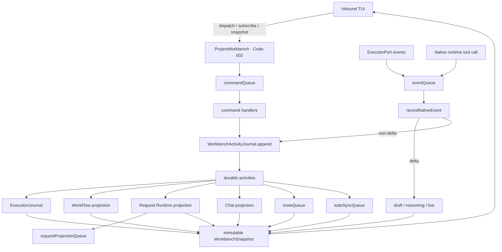

# ProjectWorkbench 동작 보존형 분해 설계

- 작성일: 2026-09-13
- 대상 기준: 현재 dirty worktree의 `src/core/application/orchestration/project-workbench.ts` 3,171행
- 범위: 읽기 전용 코드·테스트 분석과 다음 구현 패스 설계
- 제외: 코드 수정, 공개 `ProjectWorkbench` interface 변경, Code-002 이전 또는 신규 Code-ID 발급

## 판정

`ProjectWorkbench`는 단순히 큰 class가 아니라 세 개의 직렬화 축(`commandQueue`, `eventQueue`, `todoSyncQueue`)과 두 개의 비차단 축(`tnoteQueue`, `requestProjectionQueue`)을 한곳에서 맞추는 application 조정자다. 따라서 class를 책임 이름별 객체로 곧바로 쪼개면 큐 순서와 write-ahead 불변식이 callback interface로 새어나와 얕은 module 여러 개가 된다.

첫 구현 묶음은 상태와 I/O를 옮기지 않고, 이미 순수 계산으로 존재하는 두 책임을 추출한다.

1. Raw Native event를 안전한 durable/delta 의미로 바꾸는 `native-event-projection.ts`
2. 완료된 한 turn의 T-note source 범위를 판정하는 `completed-turn-note-scope.ts`

두 module은 in-process dependency만 가지며 각각 하나의 주 interface로 테스트할 수 있다. `ProjectWorkbench`는 큐, journal append, Native 호출, Todo/T-note I/O, publish 순서를 계속 소유한다. 이 방식이면 공개 surface와 Code-002 소유권을 유지하면서 약 250~330행의 shape 판정·redaction·범위 계산을 먼저 분리할 수 있다.

## 보존해야 하는 외부 interface

현재 호출자가 아는 `ProjectWorkbench` interface는 다음과 같다. 첫 추출에서 이름, 매개변수, 반환형, import 경로를 모두 그대로 둔다.

| Surface | 현재 위치 | 보존 계약 |
|---|---:|---|
| `new ProjectWorkbench(native, journal, options)` | `project-workbench.ts:364-430` | `ExecutorPort`, `WorkbenchActivityJournal`, `ProjectWorkbenchOptions` 조립과 즉시 초기화 시작 |
| `snapshot` | `433-435` | 마지막 immutable `WorkbenchSnapshot` 반환 |
| `refreshModels()` | `438-453` | 동시 조회 coalesce, last-good catalog 보존, 실패가 session을 죽이지 않음 |
| `backgroundWorkState` | `456-461` | 보이는 Native item만 이용한 보수적 projection |
| `waitUntilReady()` | `464-466` | resume/조립 실패를 session 노출 전에 전달 |
| `subscribe(listener, afterSequence?)` | `468-472` | 현재 snapshot 즉시 전달 조건과 unsubscribe |
| `dispatch(command)` | `474-490` | `WorkbenchCommand` 전체, cancellation/runtime approval의 out-of-band 예외, 나머지 FIFO 직렬화 |
| `close()` | `599-616` | idempotent 종료, runtime tool 해제, 모든 queue 정산 후 Native close |

같은 파일에서 export되는 `WorkbenchActivityJournal`(`149-156`), `WorkbenchTodoSource`(`158-175`), `WorkbenchTNoteSource`(`177-189`), `ProjectWorkbenchOptions`(`191-236`)도 경로 호환을 위해 남긴다. `WorkbenchCommand`, `WorkbenchCommandReceipt`, `WorkbenchSnapshot`의 정본은 `src/core/domain/work/workbench.ts:133-243`이며 변경하지 않는다.

## Code-002 보존 계약

- 원장: `.www/control-ledger/code-ids.json`의 `0002`, 이름 `Chat 대화 수명`, location `src/core/application/orchestration/project-workbench.ts#ProjectWorkbench`.
- schema v2 원장: `.www/control-ledger/traceability-v2.json`의 `Code-002`, UUID `aadefd19-a432-4fc8-9ff2-c63b3fed01c9`, alias `0002`, 같은 location.
- 대표 선언: `project-workbench.ts:238-244`의 `@Unit Code-002`, `@codeId 0002`, `export class ProjectWorkbench`.
- 첫 추출 뒤에도 위 세 항목은 그대로 둔다. 새 helper module에는 `@Unit`이나 `@codeId`를 붙이지 않는다. Chat 대화 수명의 application owner가 계속 `ProjectWorkbench`이기 때문이다.
- `scripts/code-id.ts:35-67`은 top-level class/function의 대표 선언을 원장 location과 일치시키므로 annotation을 추출 module로 옮기거나 복제하면 실패한다.

## 책임 지도

행 번호는 현재 dirty 파일 기준이다. 서로 겹치는 구간은 실제 결합을 뜻한다.

### 1. Command dispatch

| Symbol/구간 | 소유 동작 | 직접 의존 |
|---|---|---|
| `commandQueue` `350` | 일반 command의 단일 FIFO | `dispatchSerialized` |
| `dispatch` `474-490` | out-of-band cancel, runtime approval resolver, 일반 command enqueue | `runtimeApproval`, `commandQueue` |
| `dispatchCancellation` `519-529` | journal/event queue에 막히지 않는 중단 | `ready`, `cancelChat` |
| `dispatchSerialized` `531-597` | closed/ready/eventQueue/read-only gate와 35개 command 분기, 공통 error mapping | 아래 모든 책임의 handler |
| Leaf handlers `758-1638` | Chat, session 설정, MCP, T-note, Todo, promotion/review, local workflow | `native`, `options` ports, state, `appendActivity`, `publish` |

내부 의존은 `dispatch -> commandQueue -> ready -> eventQueue -> handler`다. 단, `chat.cancel`은 `commandQueue`를 건너뛰고, `runtime-*` approval resolve는 해당 runtime tool이 점유한 `eventQueue`를 건너뛴다. 이 두 예외를 일반 router로 통합하면 교착 또는 늦은 cancel이 생긴다.

`dispatchSerialized`만 별도 command router로 빼는 안은 기각한다. 모든 leaf handler callback을 받는 interface가 현재 switch와 거의 같은 크기가 되어 deletion test에서 복잡도가 caller로 돌아온다.

### 2. Native event projection과 durable publication

| Symbol/구간 | 소유 동작 | 직접 의존 |
|---|---|---|
| Native subscription `413-421` | Native interlock 선처리 후 `eventQueue` 직렬화 | `ready`, `requestController`, `recordNativeEvent` |
| `recordNativeEvent` `1641-1786` | thread 소유 확인, sparse ref 정규화, delta 분기, durable observation append, approval/turn 상태 전환, projection 정리, FIFO 재개 | `nativeObservation`, owner maps, terminal sets, `appendActivity`, `applyDelta`, `drainChatQueue` |
| `projectPublicPlanFallback` `1788-1828` | plan mode의 public numbered reply를 명시적 journal activity로 보완 | activities, collaboration mode, `appendActivity` |
| `applyDelta` `1884-1980` | delta를 journal에 쓰지 않고 bounded draft/reasoning/live state로 projection | item identity, terminal sets, `appendBoundedText`, `usageTracker` |
| `appendActivity` `1982-2026` | journal 선기록, development observation, in-memory 수용, execution/workflow/narration/Todo/request 파생 | `journal`, `executionRuns`, `schedule*`, `publish` |
| Native identity/lifecycle state `2067-2164` | root thread reconcile, sparse ref owner 복원, exact terminal dedupe, 미완료 assistant 보존 | owner maps, terminal sets, activities/draft |
| Snapshot publication `2177-2321` | immutable snapshot, durable activity/chat/note cache | 모든 projection state |
| Raw event helpers `2557-2696`, `2856-2910`, `3040-3078`, `3152-3171` | event kind/phase, reasoning redaction, bounded journal evidence, identity, text 추출, bounded tail | domain types와 sanitizer만 사용 |
| Chat helpers `2976-3038` | durable message role/status/identity projection과 runtime transport message 숨김 | `ProjectActivity`, `REQUEST_REPORT_PREFIX` |

핵심 순서는 `Native event -> eventQueue -> (delta면 ephemeral publish) / (non-delta면 journal.append -> in-memory reduce -> publish)`다. `test/project-workbench.test.ts:3512`가 완료 observation을 publish하기 전에 journal 길이가 먼저 증가하는지 직접 검증한다.

### 3. Request Runtime / broker

| Symbol/구간 | 소유 동작 | 직접 의존 |
|---|---|---|
| Imports/options `12-20`, `192-196` | protocol, controller, capabilities, projection port 구성 | Core runtime/domain/ports |
| Runtime state `245-247`, `355-359` | derived cache, projection queue/dedupe, controller, registration disposer, approval state, policy | activities, Native tool port |
| Constructor wiring `369-391` | mode 유효성, controller 생성, runtime tools 등록, tool call을 command/event 순서 안으로 진입 | `RequestRuntimePolicy`, `RequestController`, `appendActivity` |
| Native interlocks `414-420` | Native approval/terminal에서 controller abort | active thread/turn |
| Runtime approval `479-517` | eventQueue 교착 없이 human decision 수용, timeout/abort/close 처리 | `pendingApproval`, runtime resolver |
| Host reconcile `564-570` | terminated turn의 recorded target read-back, 원 동작 재실행 금지 | projected request, controller recover |
| Chat intake/protocol `761-775`, `802-987`, `989-993` | managed request 판정, submitted/queued/started/failed/uncertain 기록, v1 resume 보존, v2 context 주입 | policy, protocol context, journal |
| Queue gate `995-1006` | unresolved action이 있으면 다음 request 차단 | `requestRecords` |
| Close `602-603`, `611` | controller abort, Native tool unregister, projection queue drain | runtime state |
| Projection `2193-2200`, `2390`, `2410-2443` | journal에서 request record 재구성, external projection과 7-stage Todo 비차단 동기화 | `projectRequestRuntime`, `projectRequestTodo`, Todo/projection ports |

`RequestController`는 이미 `request-controller.ts:20-31`의 명시 interface와 production/fake adapter를 가진 깊은 module이다. 남은 코드는 Workbench queue와 UI approval에 붙이는 host integration이다. 이를 첫 패스에 다시 감싸면 실제 seam이 아니라 wrapper가 되므로 보류한다.

### 4. Todo / T-note

| Symbol/구간 | 소유 동작 | 직접 의존 |
|---|---|---|
| Ports/options `158-189`, `217-220` | thread bind, Native plan/request mirror, CRUD, T-note generation, promotion/review | caller-injected adapters |
| State `253`, `256-257`, `305-306`, `337-343`, `351-352` | notes/drafts/ordinal, Todo snapshot/sync status, automatic in-flight/queue/cache | activity journal과 adapters |
| Todo subscription `409-428` | external Todo snapshot 수용과 sync 상태 갱신 | `options.todos.subscribe`, `publish` |
| Initialize/resume `654`, `669-698`, `737-739` | thread-scoped sources bind/load, resume bootstrap, 누락 T-note 재생성 | Native identity, workflow/request projection |
| T-note commands `1343-1472` | exact completed-turn scope, dedupe, ordinal, generator 호출과 validation | activities, T-note source/service |
| Todo commands `1474-1510` | request-runtime Todo의 직접 mutation 차단, CRUD/evidence/import, CAS mapping | `requestRecords`, Todo source |
| Source bind/load `1584-1615` | thread identity를 T-note/Todo source에 먼저 bind | source ports |
| Automatic T-note `1834-1881` | terminal checkpoint 후 detached generation, failure가 Chat을 막지 않음 | `tnoteQueue`, abort, visible activities |
| Snapshot projections `2199-2200`, `2299-2321`, `2358-2377` | request Todo 우선, execution Todo fallback, current-session notes | request/workflow/execution projections |
| Todo sync `2389-2491` | request-runtime 또는 Native plan 경로 선택, async queue, retryable blocked state | workflow, request records, Todo source |
| Binding/narration `2494-2554` | durable request/model ref로 Native Todo binding, optional narration 뒤 resync | activities, narrator |
| Scope helpers `2698-2794`, note/document helpers `2827-2854` | 한 완료 turn과 질문의 정확한 source 범위, canonical instruction/projection | activities와 T-note domain functions |

T-note generation과 Todo sync는 terminal Native processing의 결과지만 `eventQueue`를 오래 잡지 않도록 별도 queue에서 실행된다. `test/project-workbench.test.ts:1311`, `811`이 각각 다음 Chat과 Native activity projection이 느린 T-note/Todo I/O를 기다리지 않음을 고정한다.

### 5. Approval

| Symbol/구간 | 소유 동작 | 직접 의존 |
|---|---|---|
| State `282`, `354`, `357-358` | Native pending approval, durable dispatcher, runtime-local approval | event/command queues |
| Dispatcher construction `392-397` | bounded evidence, journal write-ahead, Native response port 연결 | `ApprovalResponseDispatcher` |
| Runtime out-of-band path `479-517` | runtime capability approval은 Native callback을 사용하지 않음 | `RequestController` abort signal |
| Native command path `1116-1129` | exact request/decision 검증 후 durable dispatcher 호출 | `workbenchApprovalDecisions` |
| Native event reconciliation `1647-1650`, `1702-1710` | sparse resolved refs 보강, pending set/clear, interlock 해제 | root thread identity, dispatcher |
| Snapshot `2242` | 현재 승인 요청을 UI에 노출 | `pendingApproval` |

Native 승인 전달 자체는 이미 `approval-dispatch.ts:55-128`의 `ApprovalResponseDispatcher` 뒤에 있다. Workbench에 남은 부분은 두 승인 authority를 동일 overlay 상태로 투영하는 조정 책임이다. 첫 패스에서 별도 approval module을 더 만들 이유가 없다.

### 6. Session / model lifecycle

| Symbol/구간 | 소유 동작 | 직접 의존 |
|---|---|---|
| State `283-300`, `344-363` | selected/effective model, catalog refresh, permission/collaboration, goal, usage, thread/turn, queues/subscriptions | Native/session sources |
| Construction `398-430` | defaults, loading snapshot, initialization, three subscriptions | options/native |
| Model refresh `438-453` | coalesced Native catalog query와 fallback/last-good behavior | `native.listModels`, `publish` |
| Ready/listener `433-472` | current state exposure와 readiness | `current`, `ready`, listeners |
| Close `599-616` | session-owned resources의 종료 순서 | 모든 queue와 ports |
| Initialize/resume `618-740` | journal restore, corruption read-only mode, lease, Native resume/read identity fail-closed, bound source, active turn reconstruction | journal, executionRuns, Native, Todo/T-note |
| Chat turn start/cancel `758-1087` | thread creation, lease/source bind, context/model/permission 주입, active turn/FIFO/uncertain delivery | Native, settings, journal |
| Permission/model/collaboration `1187-1341` | next-turn settings, supported catalog validation, busy gate, persistence, sandbox/developer instructions | model catalog, Native settings |
| Native setting adoption `2100-2103` | provider가 돌려준 effective model/effort 반영 | thread result |
| Snapshot fields `2203-2238` | selected/effective/active model, usage, resume coverage, goal, settings | usage tracker와 session state |
| SessionGoal helpers `2796-2825` | bounded marker와 owning question 검증 | visible activities |

`SessionUsageTracker`는 이미 `session/session-usage-tracker.ts:7-90`로 분리되어 있다. model/settings도 후보지만 start/resume/turn input과 snapshot에 넓게 걸쳐 있어 순수 projection 두 개를 먼저 제거한 뒤 별도 패스로 설계하는 편이 안전하다.

## 내부 의존 지도



가장 많은 fan-out을 가진 seam은 `appendActivity`: journal 성공 뒤 activities를 갱신하고 execution receipt, workflow invalidation, narration, Native Todo/request projection, publish를 연쇄한다. 첫 추출에서 이 seam의 순서나 매개변수는 변경하지 않는다.

## 반드시 보존할 순서 불변식

1. `chat.cancel`은 `commandQueue`와 `eventQueue` 뒤에서 기다리지 않는다 (`project-workbench.test.ts:1193`).
2. Runtime approval resolve는 runtime tool handler가 점유한 `eventQueue` 뒤에 enqueue하지 않는다 (`271-311`).
3. non-delta Native observation은 durable journal append가 성공한 뒤에만 snapshot으로 보인다 (`3512-3551`).
4. delta는 journal sequence를 올리지 않고 ephemeral revision만 올린다 (`3512-3617`).
5. raw reasoning은 durable payload와 public draft에 노출하지 않고 public summary만 분리한다 (`3619-3734`).
6. thread/turn/item의 exact owner가 확인되지 않으면 sparse assistant completion/delta를 수용하지 않는다 (`2295-3117`, `3892-3954`, `4367-4387`).
7. terminal item/turn은 동일 identity의 draft/live projection만 지운다 (`2847-3053`, `3892-3954`).
8. resume는 provider가 다른 thread identity를 반환하면 read/journal 전에 fail closed한다 (`3736-3801`).
9. approval response는 prepared observation을 durable append한 뒤 Native에 전송하며 uncertain 전송을 재시도하지 않는다 (`3374-3436`).
10. T-note와 Todo mirror 실패/지연은 Chat 실행을 막지 않는다 (`811-953`, `1311-1897`).
11. brokered request의 unconfirmed action은 다음 request와 host reconcile의 재실행을 막는다 (`248-394`, `995-1006`).
12. `close()`는 새 작업을 차단하고 controller/subscription을 해제한 뒤 기존 queue를 정산하며, close 뒤 FIFO를 drain하지 않는다 (`3324-3339`).

## 첫 추출 1: NativeEventProjection

### 파일과 소유권

- 새 파일: `src/core/application/orchestration/native-event-projection.ts`
- module 책임: Raw `NativeHarnessEvent`의 shape를 해석해 Workbench가 사용할 안전한 의미를 반환한다. journal I/O, Workbench state, queue, publish는 소유하지 않는다.
- import 방향: `project-workbench.ts -> native-event-projection.ts -> core/domain/{execution,review}`. 새 module은 `project-workbench.ts`, adapters, ports, runtime을 import하지 않는다.

### 작은 interface

```ts
export type NativeEventProjection =
  | {
      readonly type: "delta";
      readonly method: string;
      readonly refs: NativeRefs;
      readonly text: string;
      readonly channel: "assistant" | "reasoning" | "reasoning-summary" | "activity";
      readonly activityKind: ProjectActivityKind;
    }
  | {
      readonly type: "durable";
      readonly observation: {
        readonly kind: ProjectActivityKind;
        readonly phase: ProjectActivityPhase;
        readonly refs: NativeRefs;
        readonly payload: Readonly<Record<string, unknown>>;
      };
      readonly lifecycle: "started" | "terminal" | null;
      readonly assistantMessage: boolean;
    };

export function projectNativeEvent(event: NativeHarnessEvent): NativeEventProjection;

export function projectNativeEvidence(
  value: unknown,
): { readonly value: unknown; readonly omitted: boolean };

export function nativeTurnLifecycle(
  method: string,
): "started" | "terminal" | null;
```

`projectNativeEvent` 하나가 기존 caller가 따로 조합하던 `isDeltaNotification`, raw event text 추출, reasoning channel 판정, `nativeObservation`, `activityKind`, `activityPhase`, `isAssistantMessageObservation`을 감춘다. `projectNativeEvidence`는 같은 bounded/redacted projection을 Native journal과 `ApprovalResponseDispatcher`에서 재사용하게 해 locality를 만든다. `nativeTurnLifecycle`는 raw event뿐 아니라 restored `ProjectActivity`의 method에도 적용해야 해서 별도 함수로 남긴다.

### 이동할 현재 symbol

- 상수 `JOURNAL_NATIVE_*`와 `JOURNAL_NATIVE_OMISSION`: `100-108`
- `JournalNativeProjectionState`: `143-147`
- `nativeObservation`: `2557-2617`
- `nativeReasoningSummary`: `2619-2631`
- `boundedJournalNativeValue`, `projectJournalNativeValue`, `journalNativeFieldPriority`: `2633-2696`
- `activityKind`, `activityPhase`, `isDeltaNotification`, `turnLifecycle`, `isAssistantMessageObservation`: `2856-2910`
- 새 module은 raw event 전용 text/record helper를 private으로 둔다. 현재 `activityText`(`3068-3078`)와 `record`(`3112-3114`)는 stored `ProjectActivity`, plan, Chat/T-note projection도 사용하므로 첫 패스에는 `ProjectWorkbench`에 남긴다.

`nativeItemIdentity`와 sparse owner maps는 옮기지 않는다. 이들은 raw event parsing보다 Workbench가 이미 관측한 identity를 상태적으로 reconcile하는 책임이다. `applyDelta`의 bounded accumulator도 Workbench state이므로 남긴다.

### caller 변경 계약

- `recordNativeEvent`는 refs normalize 후 `projectNativeEvent(event)`를 한 번 호출한다.
- `type === "delta"`이면 기존 `applyDelta`에 projection을 전달하고 즉시 return한다.
- `type === "durable"`이면 기존과 동일하게 full raw event의 digest를 계산하고 `appendActivity`를 호출한다. digest input은 bounded projection이 아니라 원 event여야 한다.
- approval dispatcher의 `serializeEvidence`만 `projectNativeEvidence`로 교체한다.
- `rememberTerminalTurn`은 `nativeTurnLifecycle`를 사용한다.
- queue, append, publish, T-note scheduling, Todo/request scheduling 순서는 한 줄도 재배치하지 않는다.

### 테스트 전후 계약

새 `test/native-event-projection.test.ts`에서 module interface를 직접 검증한다.

- reasoning completion: raw `content`가 사라지고 `classification: reasoning`, `redacted: true`, bounded `publicSummary`만 남는다.
- oversized nested params: depth/item/text 한도를 넘으면 `observationTruncated: true`; password/credential URL이 redacted된다.
- `turn/completed` nested status `failed/cancelled/completed`가 정확한 phase로 나온다.
- `userMessage`와 unknown message type을 assistant로 분류하지 않는다.
- delta channel matrix: agent message, raw reasoning, reasoning summary, command output.
- 입력 event는 mutate하지 않는다.

기존 `test/project-workbench.test.ts`의 `1221`, `2295-3117`, `3340`, `3512-3734`, `3867-4017`, `4343-4387` 테스트는 삭제하지 않는다. 이들은 새 internal seam이 아니라 public `ProjectWorkbench` interface의 write-ahead, identity, immutable snapshot 계약을 검증한다.

## 첫 추출 2: CompletedTurnNoteScope

### 파일과 소유권

- 새 파일: `src/core/application/work/completed-turn-note-scope.ts`
- module 책임: append-only `ProjectActivity`에서 질문 하나와 정확히 완료된 한 Native turn의 source 범위를 판정한다. T-note 생성/I/O/validation/queue/ordinal은 소유하지 않는다.
- import 방향: `project-workbench.ts -> application/work/completed-turn-note-scope.ts -> core/domain/{execution,work}`. 새 module은 orchestration, adapters, ports를 import하지 않는다.

### 작은 interface

```ts
export type CompletedTurnSelector =
  | { readonly type: "turn"; readonly turnId: string }
  | { readonly type: "latest" }
  | { readonly type: "exact-selection" };

export interface CompletedTurnNoteScope {
  readonly question: string;
  readonly activities: readonly ProjectActivity[];
}

export function resolveCompletedTurnNoteScope(
  activities: readonly ProjectActivity[],
  selector: CompletedTurnSelector,
): CompletedTurnNoteScope | null;

export function questionForTurn(
  activities: readonly ProjectActivity[],
  turnId: string,
): string | null;
```

`exact-selection`은 받은 배열 전체가 한 completed turn scope와 정확히 같을 때만 성공한다. `latest`는 뒤에서부터 처음으로 유효한 completed turn을 고른다. `turn`은 자동 생성과 dedupe에 사용한다. `questionForTurn`은 terminal 여부를 추정하지 않고 `projectSessionGoal`이 동일 질문 소유권 규칙을 재사용할 때 사용한다.

### 이동할 현재 symbol

- `completedTurnNoteScope`: `2698-2723`
- `questionForTurn`, `questionIndexForTurn`: `2725-2752`
- `latestCompletedTurnNoteScope`: `2754-2764`
- `fullCompletedTurnScope`: `2766-2775`
- `normalizedQuestion`: `2791-2794`

`turnTNoteInstruction`(`2777-2789`), `projectTNote`(`2827-2840`), `canonicalTNoteDraft`(`2842-2850`)은 생성/표현 책임이므로 이번 scope module에 섞지 않고 `ProjectWorkbench`에 남긴다. 두 번째 패스에서 T-note coordinator를 설계할 때 함께 이동할 수 있다.

### caller 변경 계약

- `captureNote`: `exact-selection`을 사용하고 기존 rejection 문구를 유지한다.
- `captureSessionNote`: `latest`를 사용한다.
- `noteForTurn`, `scheduleAutomaticTNote`: `turn`을 사용한다.
- `projectSessionGoal`: `questionForTurn`을 사용한다.
- 반환 activities의 정렬, question normalization 800자 제한, thread 동일성, sequence 증가 조건을 바꾸지 않는다.

### 테스트 전후 계약

새 `test/completed-turn-note-scope.test.ts`에서 다음을 interface로 고정한다.

- outbound question + turn start + interleaved foreign-thread activity + target terminal에서 target만 선택한다.
- pre-completion, cross-turn, sequence gap/reversal, 다른 thread의 question은 null이다.
- `latest`는 가장 최근의 유효한 완료 turn을 선택한다.
- 같은 item ID나 foreign outbound question이 끼어도 thread/turn ownership으로 원 질문을 찾는다.
- normalization은 terminal sanitizer를 거쳐 bounded 800자이며 입력 activity를 mutate하지 않는다.

기존 `test/project-workbench.test.ts:1311-1897`, `2635-2676`, `4192-4258`과 `test/project-workbench-session.test.ts:672-764`는 public orchestration 회귀로 유지한다.

## 첫 구현 묶음의 변경 한계

- `ProjectWorkbench`의 public method/export와 `ProjectWorkbenchOptions` shape를 바꾸지 않는다.
- `appendActivity`, `recordNativeEvent`, `applyDelta`, `makeSnapshot`의 상태 소유권과 호출 순서를 바꾸지 않는다.
- command switch를 이동하지 않는다.
- Request Runtime, approval dispatcher, session settings, Todo/T-note I/O를 새 wrapper로 감싸지 않는다.
- 기존 tests를 helper test로 대체해 삭제하지 않는다. 새 module tests는 shape/scope interface를 빠르게 진단하는 보강이다.
- import cycle이 생기지 않도록 두 새 module은 `project-workbench.ts`를 import하지 않는다.

## 검증 계약과 현재 기준선

2026-09-13 현재 dirty worktree에서 실행한 결과:

| 명령 | 결과 |
|---|---|
| `bun test test/project-workbench.test.ts` | PASS, 124 tests / 701 assertions |
| `bun test test/native-plan-wiring.test.ts test/project-workbench-session.test.ts test/native-model-catalog.test.ts test/request-runtime.test.ts test/request-controller.test.ts test/request-runtime-mode.test.ts` | PASS, 77 tests / 533 assertions |
| `bun test test/architecture.test.ts test/code-id.test.ts` | PASS, 14 tests / 1,340 assertions |
| `bun scripts/code-id.ts` | FAIL, 현재 dirty TUI 이동의 old tracked paths, Code-0001~0005 detail 파일 부재, 두 대표 선언의 중복 `@linear` 등 기존 baseline 문제 |

구현 후에는 위 PASS 묶음과 새 두 module test가 모두 PASS여야 한다. `bun scripts/code-id.ts`는 현재 baseline 자체가 red이므로 최소한 새 `0002` location mismatch, duplicate representative declaration, unregistered declaration을 추가하지 않아야 한다. 전체 Code-ID green을 완료 조건으로 주장하려면 별도 진행 중인 TUI/원장 dirty 변경까지 정합된 상태에서 다시 실행해야 한다.

마지막으로 `bun run check`와 다음 회귀 묶음을 한 번 실행한다.

```sh
bun test test/native-event-projection.test.ts \
  test/completed-turn-note-scope.test.ts \
  test/project-workbench.test.ts \
  test/native-plan-wiring.test.ts \
  test/project-workbench-session.test.ts \
  test/native-model-catalog.test.ts \
  test/request-runtime.test.ts \
  test/request-controller.test.ts \
  test/request-runtime-mode.test.ts \
  test/architecture.test.ts
```

## 다음 stateful 추출 순서

첫 묶음 뒤 두 번째 설계 패스는 `SessionSettings`를 우선한다. model catalog, selected/effective model, permission, sandbox, collaboration의 state를 한 module로 모으되 `startThread`/`startTurn` I/O는 Workbench에 남기고 settings snapshot만 반환해야 한다. 그 다음에 T-note generator/queue/dedupe를 coordinator로 옮긴다.

Request Runtime host integration과 approval overlay는 마지막에 다룬다. 둘은 command/event queue의 out-of-band 예외를 공유하며, 먼저 떼면 교착 방지 규칙이 새 callback interface에 노출될 가능성이 가장 크다.
