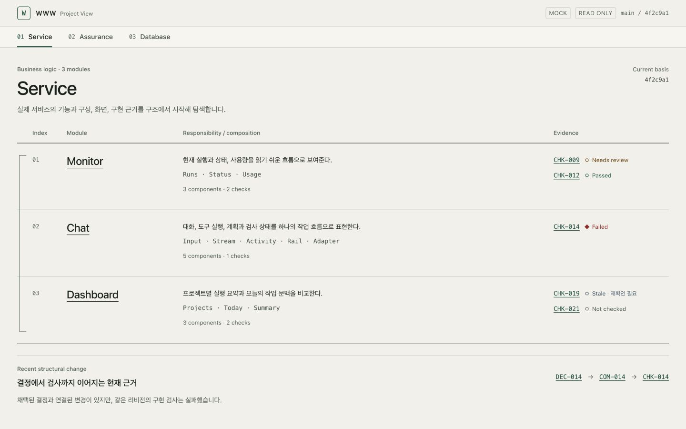
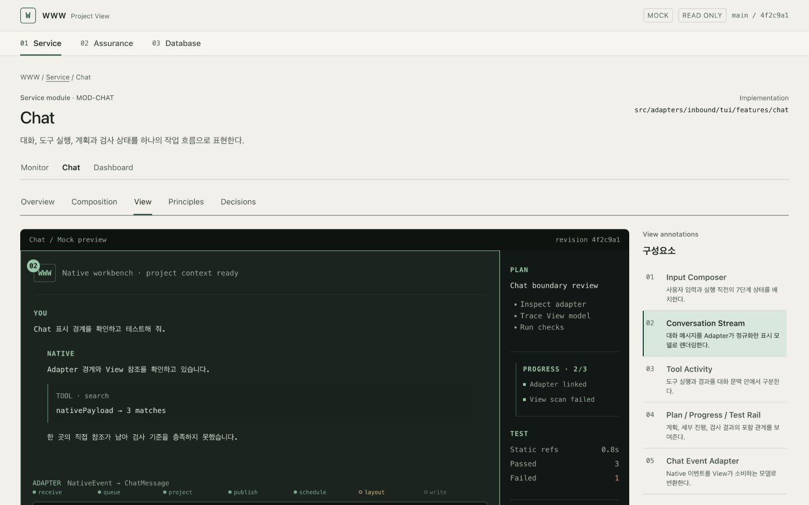
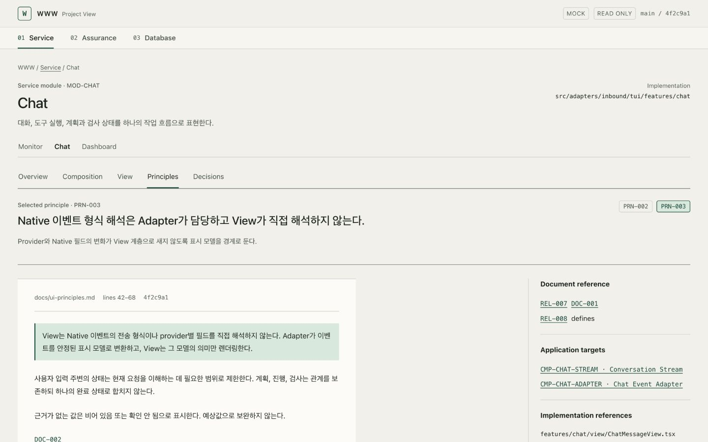
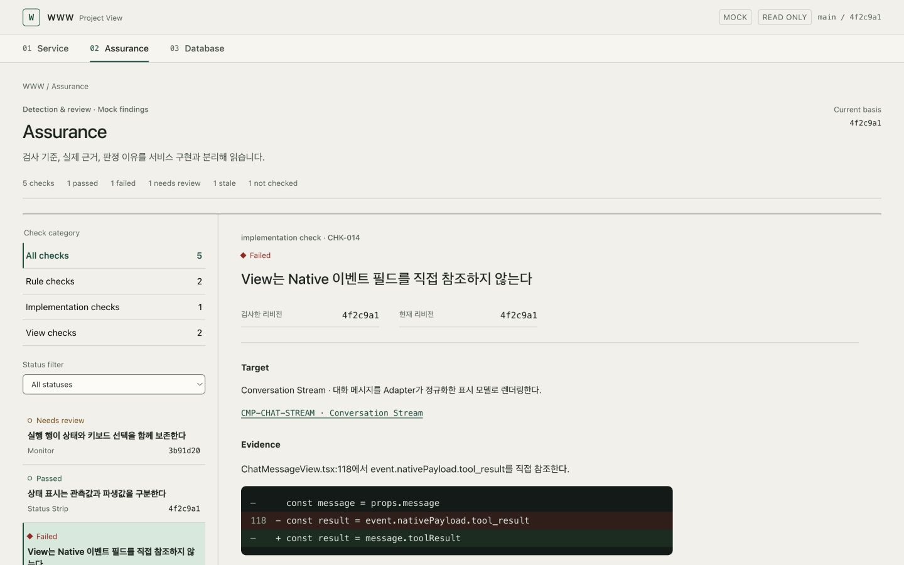
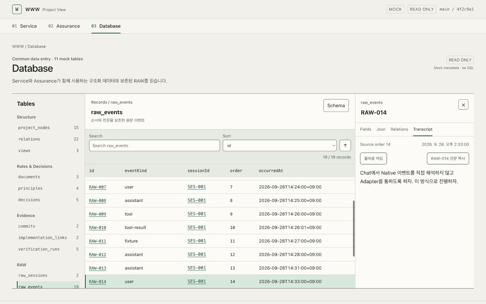

# Project View MVP 구현 결과

작성일: 2026-10-03 · 대상: `99_www/apps/project-view`

이 문서는 표·문서 중심으로 구현한 초기 버전 기록이다. 이후 사용자 요청으로
첫 화면을 [노드 그래프 캔버스](PROJECT_VIEW_NODE_CANVAS.md)로 전환했다.

## 실행과 범위

두 다운로드 문서의 요구사항을 `99_www` 안의 독립 브라우저 패키지에 반영했다.
[실행 안내와 화면별 링크](PROJECT_VIEW.md)를 통해 탐색할 수 있다.

```sh
# 99_www 루트
npm run project-view:dev
```

주소: <http://127.0.0.1:4173/projects/www/service>

Service 구조에서 모듈의 구성·View·원칙·결정으로 내려가고, Assurance 검사와
Database의 원문·관계로 이어진다. 모든 화면은 읽기 전용 목업 데이터를 사용한다.
실제 Native 실행, 운영 DB, Git 분석, 편집·저장 API는 이번 MVP 범위에 없다.

## 핵심 파일

| 파일 | 책임 |
|---|---|
| `apps/project-view/src/mock-db.ts` | 11개 테이블, 82개 목업 레코드와 명시적 관계 |
| `apps/project-view/src/model.ts` | 레코드 타입, 상태, View 주석과 문서 문단 참조 |
| `apps/project-view/src/selectors.ts` | 공통 조회, 외래키와 관계의 참조, 참조 무결성 로직 |
| `apps/project-view/src/service.tsx` | Service, 모듈 상세, TUI 목업, 원칙·결정 |
| `apps/project-view/src/assurance.tsx` | 검사 필터, 근거, 판정과 리비전 |
| `apps/project-view/src/database.tsx` | 테이블·스키마·레코드·JSON·관계·RAW 전문 |
| `apps/project-view/src/navigation.tsx` | URL, 브라우저 이력, 선택과 스크롤 복원 |
| `apps/project-view/src/common.tsx` | 근거 인스펙터, 복사, 공통 탐색 |
| `apps/project-view/src/styles.css` | Structure Desk 색상·간격·문자·반응형 스타일 |

## 구현에서 유지한 의미

- `DEC-014`는 채택됨, `COM-014`는 연결됨, `CHK-014`는 실패로 각각 표시한다.
- 문서 참조, 원칙 적용 대상, 실행 입력에 포함된 근거, 실제 검사 결과를 분리한다.
- `DOC-001`의 실행 입력 포함 여부는 근거가 없으므로 `null`이다.
- 관계 화면은 `refs`와 타입에 선언된 참조 필드를 함께 읽는다.
- RAW는 원문과 줄바꿈을 보존하고 `null`, 빈 문자열, `false`, `0`을 구별한다.
- Assurance 필터와 선택, Database 검색·정렬·상세는 URL에 기록한다.

## 실행한 확인과 한계

| 항목 | 결과와 범위 |
|---|---|
| 최종 프로덕션 빌드 | `npm run project-view:build` 통과. TypeScript 검사 포함, 24개 모듈 빌드 |
| 가독성 정적 검사 | 변경한 TS/TSX의 import·표 정렬 검사 통과 |
| 미완성 표식 | 소스·테스트에서 TODO/FIXME/TBD 및 skip/only 표식 없음 |
| 이전 자동화 검사 | 수정 전 navigation 14개와 data 7개 통과 기록 보존 |
| 리뷰 후 자동화 검사 | 이번 재개에서는 추가·재실행하지 않음. 이전 통과를 최신 수정의 통과로 간주하지 않음 |
| 화면 캡처 | 1440×900, 1920×1080, 1024×900의 대표 5개 화면 저장 |
| 독립 정적 리뷰 | Claude Sonnet 5: 데이터·스키마·표시 의미 PASS. Claude Opus(`opus`): 탐색·접근성 통합 감사 PASS, 마지막 3건 수정 재검토 PASS |
| 확대·입력 한계 | 실제 브라우저 200% 확대, 한국어 IME 조합 입력, 전체 접근성 감사는 미확인 |

최종 빌드 로그는
[final-build.log](../.www/evidence/2026-10-03-project-view-review-fixes/final-build.log)에,
소스 수정 근거는
[탐색·접근성 기록](../.www/evidence/2026-10-03-project-view-review-fixes/navigation/receipt.md)과
[데이터 의미 기록](../.www/evidence/2026-10-03-project-view-review-fixes/semantics/receipt.md)에 남겼다.

읽기 전용 독립 리뷰 전문:
[Sonnet 리뷰](../.www/scratchpad/2026-10-02-project-view-mvp/sonnet-final.md),
[Opus 통합 감사](../.www/scratchpad/2026-10-02-project-view-mvp/opus-final.md),
[Opus 마지막 수정 확인](../.www/scratchpad/2026-10-02-project-view-mvp/opus-closeout.md).
리뷰어에게 파일 쓰기·명령 실행 권한은 주지 않았다.

## 대표 화면

아래는 1440×900 캡처다. 같은 폴더에 `-1920.png`, `-1024.png` 캡처도 있다.

### Service



### Chat View



### Principles



### Assurance



### Database RAW


