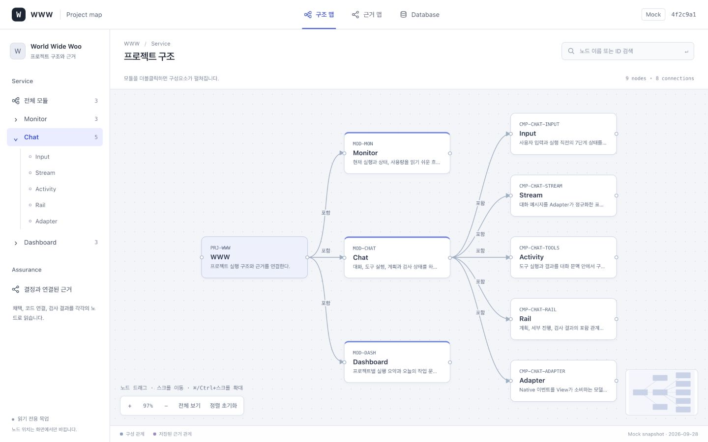
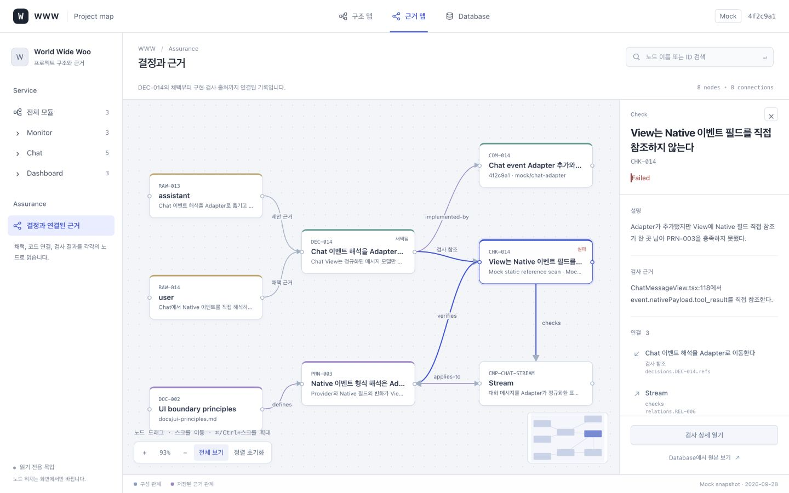

# Project View 노드 캔버스

2026-10-03 사용자 요청: 자유 배치·확대·이동이 가능한 노드 그래프 캔버스로 전환.

## 열기

```sh
# 99_www 루트
npm run project-view:dev
```

- [구조 맵](http://127.0.0.1:4173/projects/www/service)
- [결정과 근거 맵](http://127.0.0.1:4173/projects/www/assurance?scope=chat)

구조 맵은 WWW와 세 모듈을 보여주며, 기본으로 Chat의 구성요소를 펼친다.
왼쪽 탐색기에서 다른 모듈을 선택하거나 모듈 노드를 더블클릭하면 하위 구성요소가 바뀐다.

## 조작

| 조작 | 결과 |
|---|---|
| 노드 클릭 | 오른쪽 상세 패널에서 책임·구현·연결 근거 확인 |
| 노드 드래그 | 해당 노드를 자유 배치하고 연결선 갱신 |
| 빈 캔버스 드래그·스크롤 | 캔버스 이동 |
| ⌘/Ctrl + 스크롤, +/− 버튼 | 확대·축소 |
| 전체 보기 | 현재 노드를 화면에 맞춰 배치 |
| 정렬 초기화 | 노드 좌표를 기본값으로 복원하고 전체 보기 |
| 미니맵 클릭 | 클릭한 위치로 캔버스 중심 이동 |
| 이름·ID 검색 | 일치하는 노드를 강조하고 결과에서 선택 |
| 상세의 연결 노드 클릭 | 연결된 객체로 선택 이동 |
| View·검사 상세·Database 링크 | 원래 상세 화면과 원본 레코드 열기 |

키보드로 노드와 도구를 선택할 수 있다. 캔버스의 방향키는 화면을 이동하며,
노드나 상세 패널에 포커스가 있을 때 Escape를 누르면 패널을 닫고 선택 노드로 포커스를 되돌린다.

## 데이터 의미

구성 연결선은 `project_nodes.parentId`, 근거 연결선은 저장된 relation 또는
레코드 참조 필드에서 나온다. 각 연결의 근거 경로를 상세 패널에 표시한다.
DEC-014의 채택, COM-014의 연결, CHK-014의 실패는 별도 노드와 상태로 유지한다.

상단 Database와 개별 View·검사 상세는 깊은 내용을 읽는 화면으로 연결된다.
새 그래프 화면은 추가 외부 패키지 없이 React·SVG·Pointer Events로 구현했다.

## 소스

- `apps/project-view/src/graph-model.ts`: 목업 레코드와 관계를 노드·연결선으로 투영
- `apps/project-view/src/node-canvas.tsx`: 드래그·이동·확대·미니맵과 연결선
- `apps/project-view/src/graph-page.tsx`: 탐색·검색·URL 선택·상세 패널
- `apps/project-view/src/graph.css`: 노드 화면의 스타일과 반응형 배치
- `apps/project-view/src/App.tsx`: 그래프와 기존 상세 경로 연결

## 범위와 한계

읽기 전용 목업이며, 노드 배치는 현재 화면에서만 유지한다. 다른 맵으로 이동하거나
새로고침하면 기본 배치로 돌아온다. 위치 저장 API, 노드 생성·삭제, 연결 편집은 없다.
기존 운영 DB·Native 실행과 연결하지 않는다.

이 전환에서 자동테스트는 추가하거나 실행하지 않았다. 이전 화면의 테스트 결과를
노드 버전의 통과 근거로 사용하지 않는다.

## 화면





## 완료 기록

타입 검사와 프로덕션 빌드가 통과했고, 읽기 전용 Sonnet 5 리뷰와 Opus 최종 감사는 PASS다.
전체 실행 기록·소스 지문·남은 비차단 한계는 [전환 기록](../.www/evidence/2026-10-03-project-view-nodes/receipt.md)에 남겼다.
